# Four-Channel EMG Analog Front End

This document outlines the design for an Analog Front End of a Four Channel Electromyography (EMG) system. This board was designed for and with Dr. Robert Chen's Lab at the Krembil Research Institute and is intended to replace their current aging EMG analog front ends.

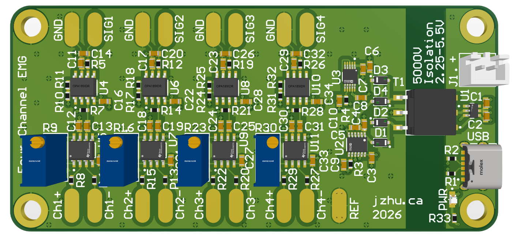

## Main Features

Analog Front End:
- INA828IDR and OPA189IDR High Common-Mode Rejection (CMRR) and Input Impedance Instrumental and Operational Amplifiers
- Stage one 6x+ gain
- 10 Hz First-order High Pass Filter
- Stage two 51x gain
- 400 Hz First-order Low Pass Filter
- Total gain range of 306+

Power:
- USB-C Power or external power supply with 2.25–5.5 V input range
- Low Noise and EMI SN6505 Push-Pull Transformer Setup
- Galvanically isolated power architecture with a 5kV rated 1:2 transformer (Wurth Elektronik 750313626) 
- Low Noise bipolar post-regulation using the LT3042 and LT3094 regulators to attenuate switching-converter ripple and generate clean +-5V

## Validation
The graphs below are recorded during a basic pinch test. Both systems were set to 1k total gain and recorded using the same high-definition ADC. It can be seen that the new board (my board) has less noise around baseline by inspection in comparison to the currently operated system.

#### New Board
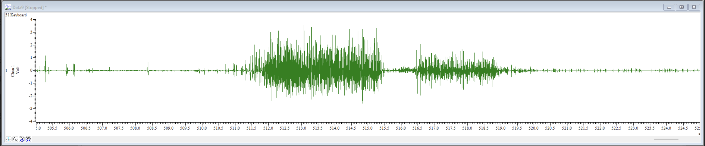

#### Current Board
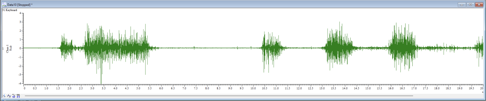

### Pictures
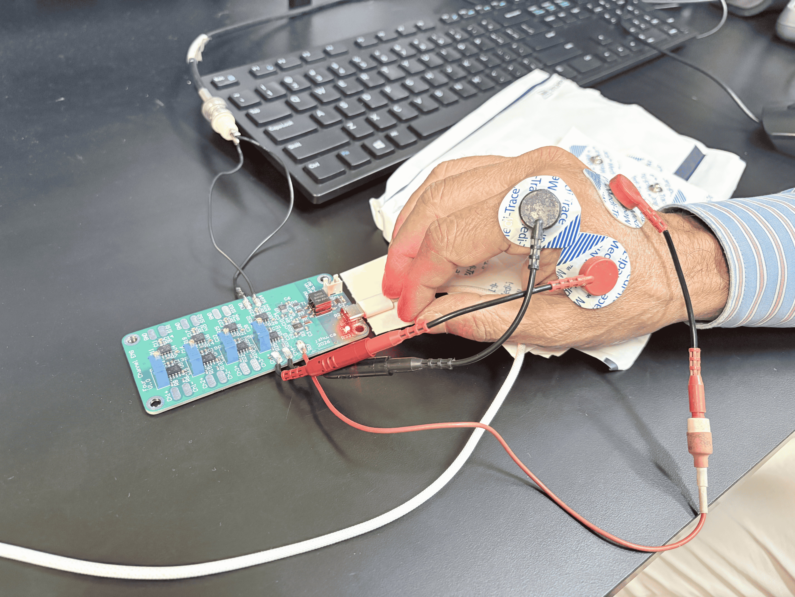 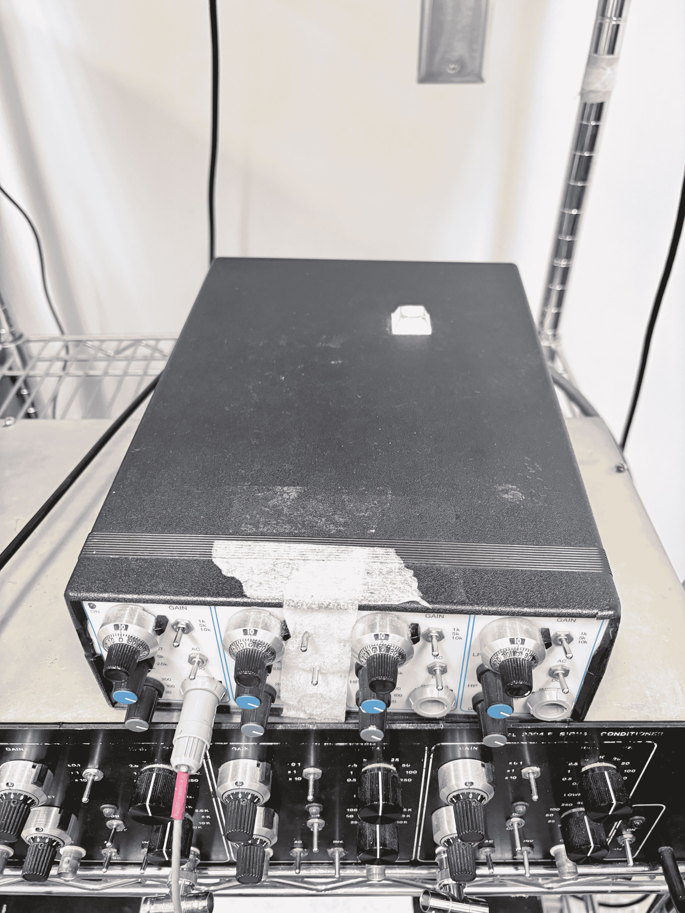    

Recording of a pinch test with new board on the left and current EMG analog front end on the right. 

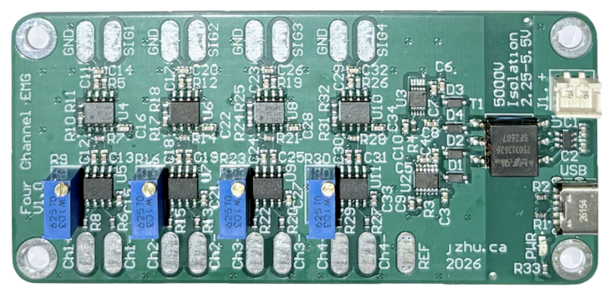

#### More details will be added in regard to testing and utilization.

## SPICE Simulation
Surface-EMG signals are low-amplitude biopotential signals that are in the range of 0-10mV peak-to-peak and have a frequency in the hundreds of Hz range.
Thus, this design amplifies signals within the 10-400Hz range.

The following simulation results from setting the variable stage one gain to 10x.

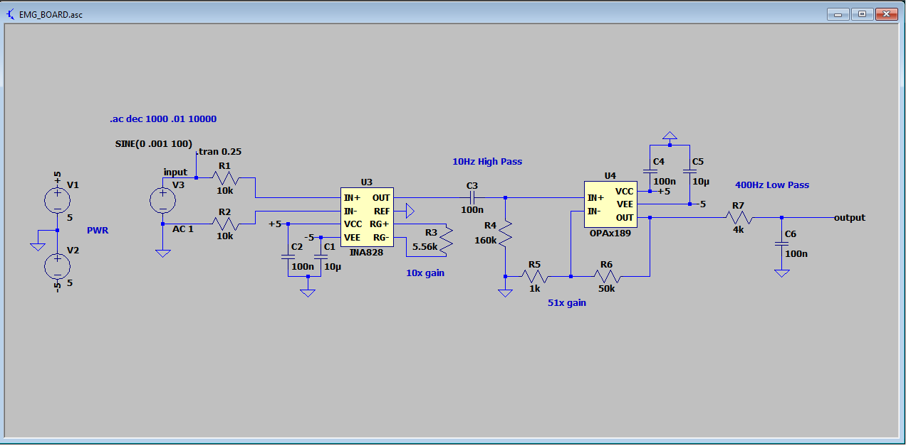

### Frequency Response
Circuit Frequency Response from .01Hz to 10kHz. Note the first order 10 Hz High Pass and 400 Hz Low Pass Filters.

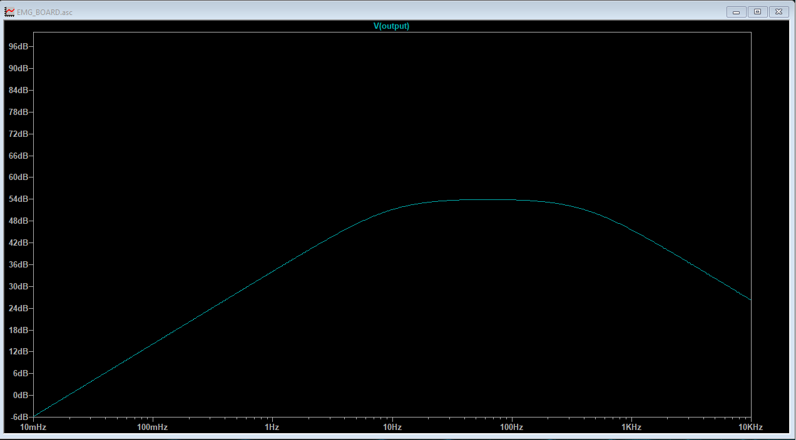

### Transient Response
250ms transient response for a 100Hz 1mV sin wave with 200mV DC offset.

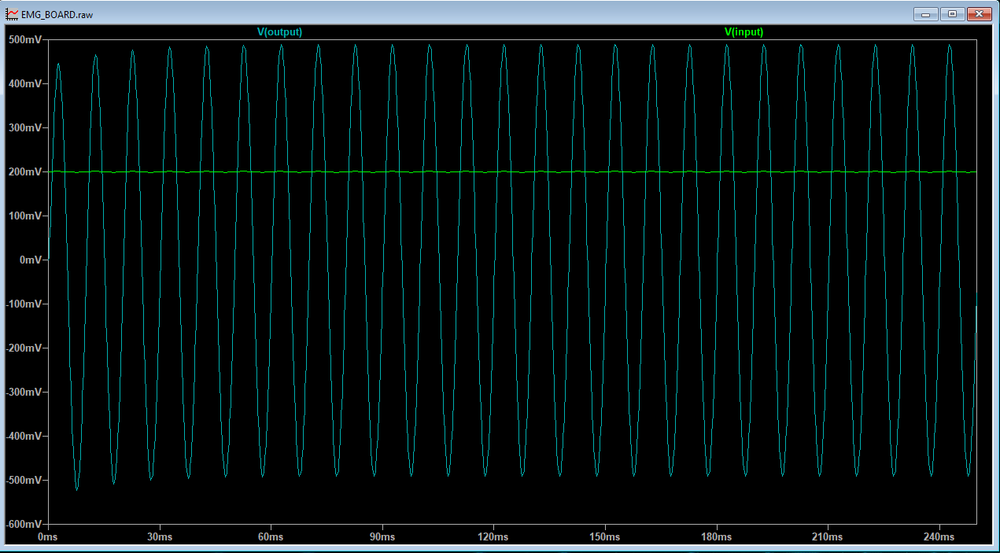

## Schematic

### Analog Front End
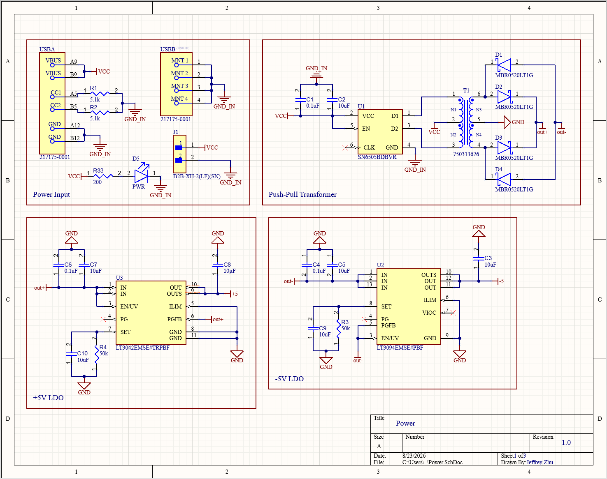

### Power
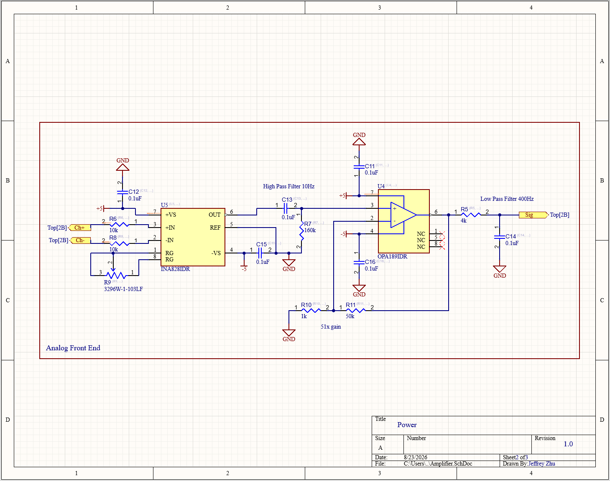

### Top Sheet
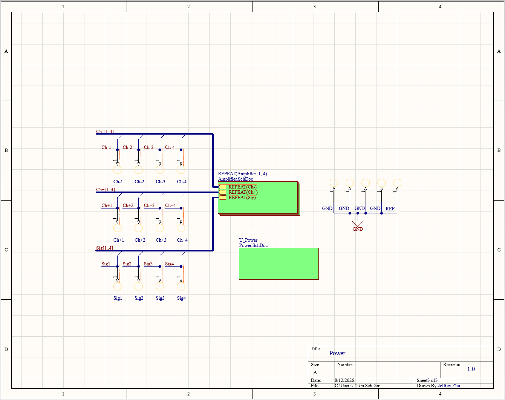

## Layer Stackup

| Layer | Purpose |
|-------|--------|
| 1     | Signal |
| 2     | Ground |
| 3     | Power  |
| 4     | Ground |

### Top Signal with Ground Pour
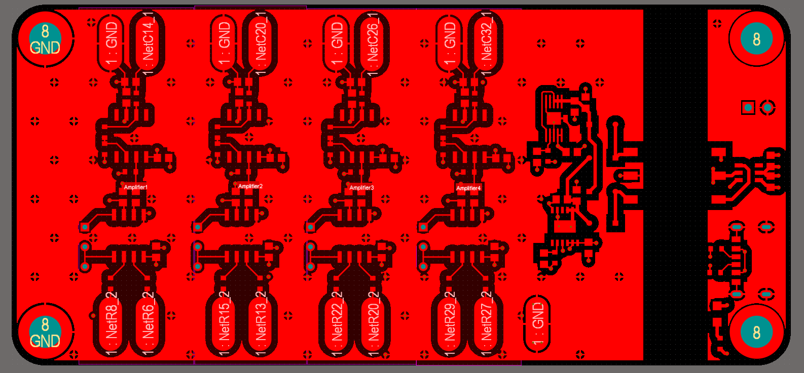

### Power
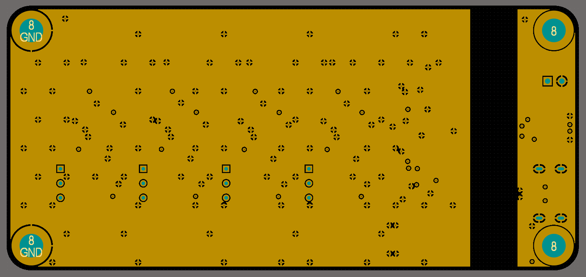

### Ground
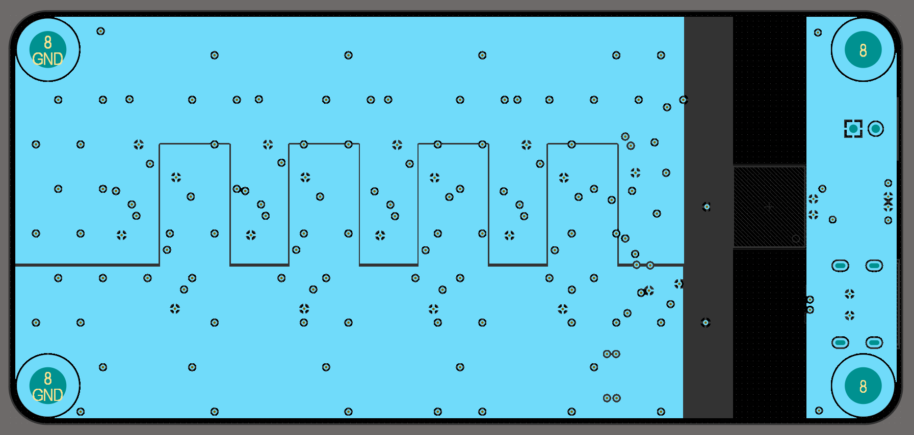

The top half contains the +5V net and the bottom half contains the -5V net.

### Bottom Ground
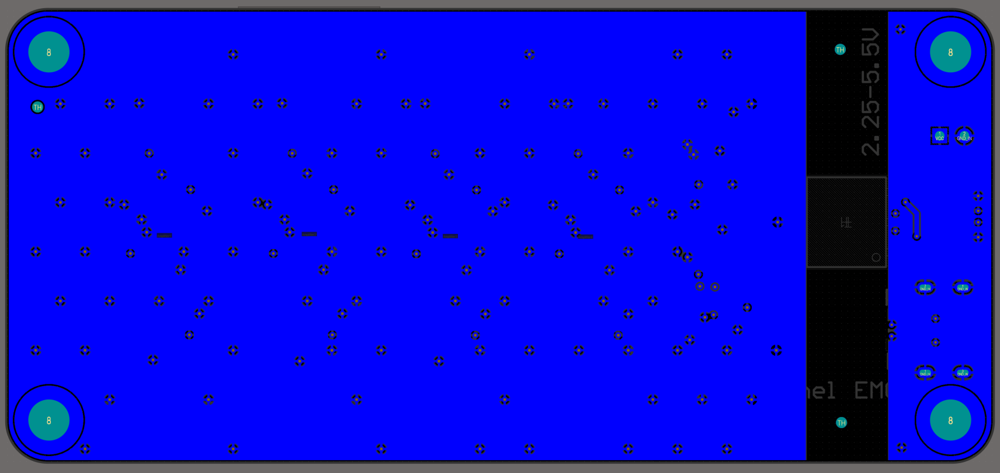

## License
[EMG_Board](https://github.com/jeffrey500/EMG_Board) © 2026 by [Jeffrey Zhu](https://jzhu.ca) is licensed under a [Creative Commons Attribution-NonCommercial-ShareAlike 4.0 International License](https://creativecommons.org/licenses/by-nc-sa/4.0/).

